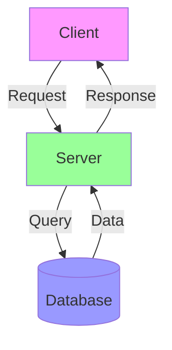

# Тестовая диаграмма

```mermaid
graph TD
    A[Client]
    B[Server]
    C[(Database)]

    A -->|Request| B
    B -->|Query| C
    C -->|Data| B
    B -->|Response| A

    classDef client fill:#f9f
    classDef server fill:#9f9
    classDef db fill:#99f

    class A client;
    class B server;
    class C db;
``` 